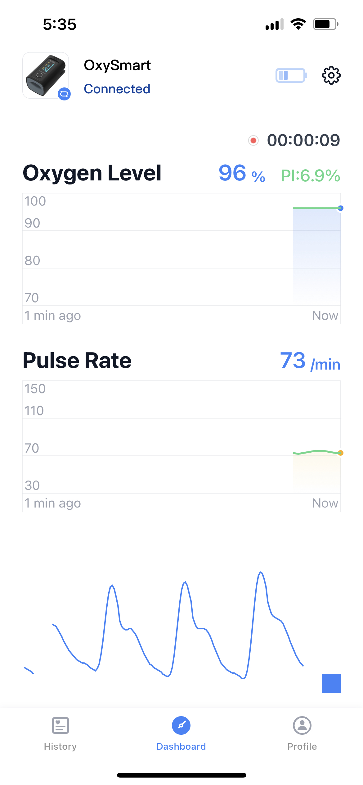
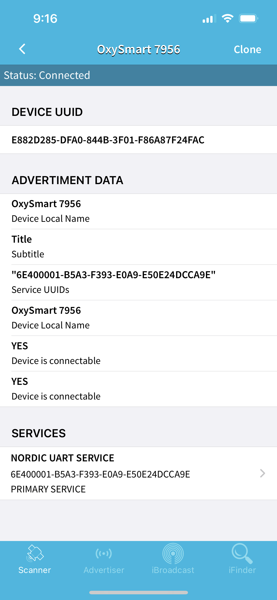
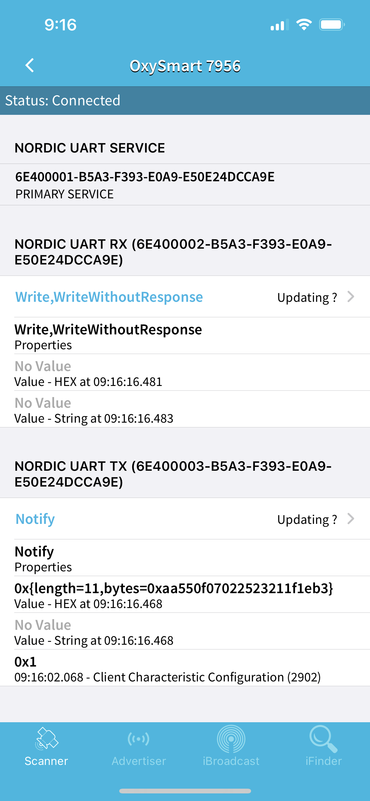
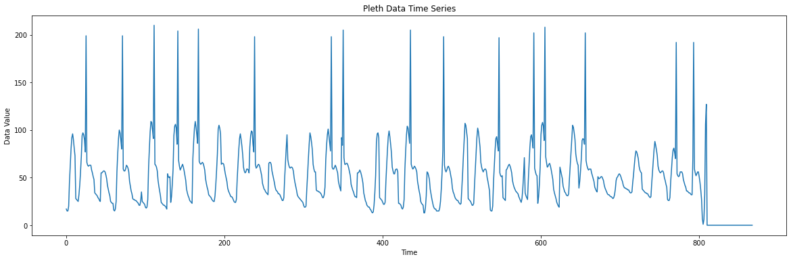
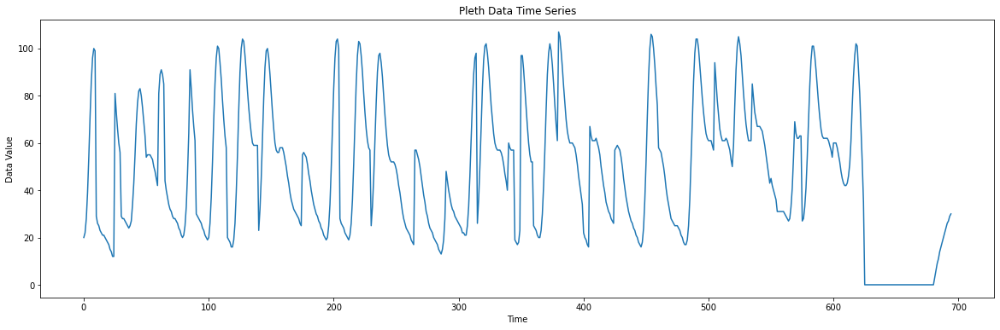
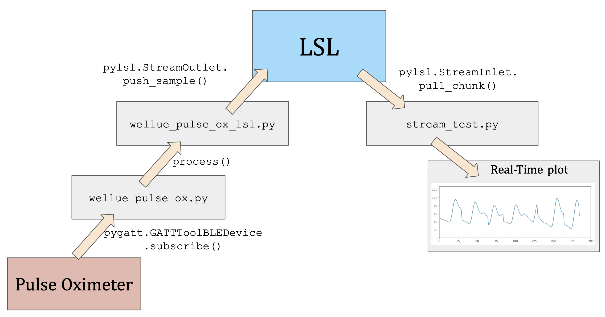
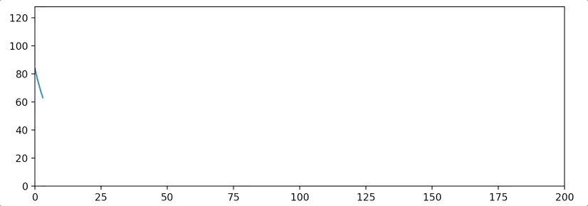

# Pulse-Ox-BLE

Stream and visualize plethysmogram (PPG) data from Wellue Bluetooth Pulse Oximeter using Pygatt and Lab Streaming Layer (LSL)


---


## Requirements

### Hardware

* [Wellue Bluetooth Pulse Oximeter](https://www.amazon.com/gp/product/B085ZFDMMX/ref=ppx_yo_dt_b_search_asin_title?ie=UTF8&psc=1): To collect pulse oximetry data.
* [BLED112 USB dongle](https://www.digikey.com/en/products/detail/silicon-labs/BLED112-V1/4245505): Because most computers do not have a built-in Bluetooth Low Energy (BLE) radio.

### Software

* The basics: python, numpy, matplotlib, scipy.
* `pygatt`: To connect to the BLE device.
* `pylsl`: the interface to the Lab Streaming Layer (LSL), a protocol for real-time streaming of biosignal over a network. Here is their [documentation](https://labstreaminglayer.readthedocs.io/). Here are some [example code](https://github.com/labstreaminglayer/pylsl/tree/master/pylsl/examples). Here is a [YouTube tutorial on LSL](https://youtu.be/Y1at7yrcFW0?si=V298gu2gYSO6tr3a).

---


## Tutorial


### 1. Understand your pulse oximeter

Wellue provides an app called ViHealth to connect and visualize the data from their pulse oximter:



Before we start, we must get the UUIDs of the services of the pulse oximeter. We can download the "BLE Scanner" app from the App Store to do this. Once downloaded, connect to the pulse oximeter and open the BLE scanner app. Look for a device called "OxySmart" and click on it. You should see the following screen:



As you can see, my device is called "OxySmart 7956". Click on the "SERVICES" tab and you should see the following screen:



We are interested in "NORDIC UART TX" service, which has the UUID: 6E400003-B5A3-F393-E0A9-E50E24DCCA9E. Copy this UUID and save it somewhere. We will need it later.


---


### 2. Connect to Wellue Bluetooth Pulse Oximeter using `pygatt`

It is best to handle the BLE device you want to connect to using an object-oriented approach. Let's navigate to `wellue_pulse_ox.py`. The class `WelluePulseOx` is defined here. But at this point, we only need to focus on the following methods:

```python
import platform
from time import time
import numpy as np
import pygatt

CHUNK_SIZE = 5

class WelluePulseOx:
    def __init__(self, callback=None, time_func=time, name=None):
        # Initialze fields (not shown)

    def connect(self):
        self.adapter = pygatt.GATTToolBackend(self.interface) if self.backend == 'gatt' else pygatt.BGAPIBackend(serial_port=self.interface)
        self.adapter.start()

        self.address = self.find_device_address(self.name)
        if not self.address:
            raise ValueError(f"Can't find Device {self.name}")

        print(f"Connecting to {self.name} with address {self.address}...")
        self.device = self.adapter.connect(self.address, address_type=pygatt.BLEAddressType.random, timeout=10)

        self._subscribe()
        print('Connected')

    def find_device_address(self, name=None):
        devices = {device['name']: device['address']
                   for device in self.adapter.scan(timeout=10.5)}
        return devices.get(name, None)

    def start(self):
        print('Start streaming')

    def stop(self):
        print('Stop streaming')

    def disconnect(self):
        self.device.disconnect()
        self.adapter.stop()
        print('Disconnected')

    def _subscribe(self):
        self.device.subscribe("6E400003-B5A3-F393-E0A9-E50E24DCCA9E", callback=self._handle_data)

    def _handle_data(self, handle, data):
        with open("packets.txt", "a") as f:
            raw_data = repr(data)[12:-2]  # remove the `bytearray(b` and `)` wrapper text
            f.write(f"{raw_data}\n")
        # Other stuff (implement later)
```

This class is intended to be used like this in another file that we will call `wellue_pulse_ox_lsl.py`:

```python
from wellue_pulse_ox import WelluePulseOx
from time import sleep

DEVICE_NAME = 'OxySmart 7956'  # Replace with your device name

def process(data):
    pass
    # TODO: Do something with the data

pulseOx = WelluePulseOx(name=DEVICE_NAME, callback=process)
pulseOx.connect()
pulseOx.start()

while 1:
    try:
        sleep(1)
    except:
        break

pulseOx.stop()
pulseOx.disconnect()
```

So far, the `_handle_data()` method just write the raw data to a file called `packets.txt`. This is necessary because so far we don't know what each packet means. We will figure this out in the next step.


---


### 3. Understand the data format

We are lucky that the data format of Wellue Bluetooth Pulse Oximeter is pretty straightforward. Now run the `wellue_pulse_ox_lsl.py` script. This will connect to the pulse oximeter and start writing the raw data to `packets.txt`.

Let's take a look at our `packets.txt` file:

```
\xaaU\x0f\x07\x02afe_X\x8b
\xaaU\x0f\x07\x02\xd0HA=;*
\xaaU\x0f\x07\x02<=>>=\xc0
\xaaU\x0f\x07\x02:62-*\xd4
\xaaU\x0f\x07\x02&#!\x1f\x1e\xfd
\xaaU\x0f\x07\x02\x1c\x1c\x1b\x1a\x18\x80
```

Looks like garbage, right? Let's convert each byte to its decimal value:

```python
def parse_data(byte_str):   
    # Convert to decimal
    parsed_data = [int(b) for b in byte_str]
    
    return parsed_data
```

(`reverse_engineering_packet.py` contains a more sophisticated way to parse the data, but it's not necessary for this device.)

The results of the above hexidecimal strings are:

```
[170, 85, 15, 7, 2, 97, 102, 101, 95, 88, 139]
[170, 85, 15, 7, 2, 208, 72, 65, 61, 59, 42]
[170, 85, 15, 7, 2, 60, 61, 62, 61, 61, 192]
[170, 85, 15, 7, 2, 58, 54, 50, 45, 42, 212]
[170, 85, 15, 7, 2, 38, 35, 33, 31, 30, 253]
[170, 85, 15, 7, 2, 28, 28, 27, 26, 24, 128]
```

We can see that each packet comes with 11 bytes. The first 5 bytes are the same, so they are likely the header information. Bytes 6-10 are the PPG data looks continuous. They are likely the plethysmogram data. The last byte is probably used to sometimes representing the oxygen saturation (SpO2) value and sometimes the pulse rate (PR) value, but those two values are not important for us. We will only focus on the PPG data.

Let's modify our `WelluePulseOx._handle_data()` method to save the PPG data into a text file:

```python
    def _handle_data(self, handle, data):
        timestamp = self.time_func()

        # Check if data starts with the header and has the correct length
        if data.startswith(b'\xaaU\x0f\x07\x02') and len(data) == 11:
            pleth_data = data[5:-1]  # Skip the first 5 bytes (header) and omit the last byte
            # Convert bytes to integers and print them as a list
            pleth_data_as_int = [int(b) for b in pleth_data]
            with open("pleth_data.txt", "a") as f:
                for i, b in enumerate(pleth_data_as_int):
                    f.write(f"{b} ")
```

Now, write a simple script to visualize the PPG data:

```python
import matplotlib.pyplot as plt

# Read data from file
with open("pleth_data.txt", "r") as f:
    line = f.readline()
    numbers = list(map(int, line.split()))

# Generate the time axis (assuming a fixed time step between samples)
time_axis = [i for i in range(len(numbers))]

# Plotting
plt.figure(figsize=(20, 6))
plt.plot(time_axis, numbers)
plt.title("Pleth Data Time Series")
plt.xlabel("Time")
plt.ylabel("Data Value")
plt.show()
```



We can see that the PPG data comes with a spike in values that coincides with the R wave of the ECG signal. Taking a closer look at the PPG data stored in `pleth_data.txt` reveals that the R-wave present signal is actually encoded by setting the most significant bit (MSB) of the data point to 1. This makes these data points 128 larger than the actual value. We can fix this by subtracting 128 from these data points:

```python
    def _handle_data(self, handle, data):
        timestamp = self.time_func()

        # Check if data starts with the header and has the correct length
        if data.startswith(b'\xaaU\x0f\x07\x02') and len(data) == 11:
            pleth_data = data[5:-1]  # Skip the first 5 bytes and omit the last byte
            # Convert bytes to integers and print them
            pleth_data_as_int = [int(b) for b in pleth_data]
            with open("pleth_data.txt", "a") as f:
                for i, b in enumerate(pleth_data_as_int):
                    if b > 127:
                        b = b - 128  # the first bit marks the R wave
                    f.write(f"{b} ")
```

Record some data and plot it again. Now we should have a smooth PPG signal:




---


### 4. Stream the data using LSL

So far, we only write our PPG data into a text file, but how can we stream it live in (near-)real-time? This is where LSL comes in. Think of LSL as a local network that allows you to put data streams into it and other programs can read from it. The following diagram illustrates this concept:



The above figure traces the data from the pulse oximeter to the final real-time plot. The data is first collected by the pulse oximeter, then sent to the computer via Bluetooth. The `WelluePulseOx` class in `wellue_pulse_ox.py` uses `pygatt` to subscribe to the pulse oximeter's data stream. The data is then processed by the `process()` function in `wellue_pulse_ox_lsl.py`. The processed data is then sent to the LSL stream via the `pylsl.StreamOutlet` class, via one of its methods called `push_sample()`. The LSL stream is then read by the `stream_test.py` script using the `pylsl.StreamInlet` class. The data is then plotted using `matplotlib`. 


---


### 5. Putting it all together

I have put my code in the `python` folder. To visualize the PPG data in real-time, run the following scripts in order:

```bash
python3 wellue_pulse_ox_lsl.py
```

Keep this script running. It will connect to the pulse oximeter and start streaming the PPG data to the LSL stream. Then in a new terminal, run:

```bash
python3 stream_test.py
```

You should see a plot like this:

